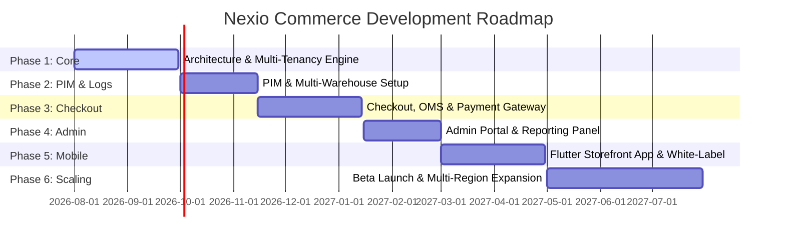

# Nexio Commerce: Product Requirements Document (PRD)
**Enterprise Multi-Tenant Headless SaaS E-Commerce Platform**  
**Version:** 1.1.0  
**Author:** Executive Product & Architecture Committee (CTO, SaaS Architect, UX Lead, Principal Database Architect)

---

## 1. Product Vision

Nexio Commerce is a high-performance, modular, API-first headless multi-tenant SaaS e-commerce platform. It is engineered to enable merchants—ranging from local retailers to multi-national enterprise brands—to create, customize, and scale their digital storefronts without facing architectural limitations. 

Unlike traditional monoliths or rigid SaaS systems, Nexio Commerce decouples the core transactional commerce engine from the storefront experience (Headless). By operating on a modern, event-driven, API-first architecture, the platform offers absolute front-end freedom while ensuring isolated, secure, and highly scalable multi-tenant execution.

### Architectural Core Pillars
* **API-First & Headless:** GraphQL and REST endpoints act as the primary, first-class interface. The core engine is completely detached from the front-end, allowing developers to build custom digital storefronts using React, Next.js, Vue, or the native Flutter mobile application.
* **Multi-Tenant SaaS with Native Multi-Store:** Tenants operate within isolated namespaces, with support for multiple sub-stores under a single tenant. A merchant can operate a B2C fashion store, a B2B parts catalog, and a regional retail store from one single dashboard.
* **Global by Design:** Multi-language (native LTR/RTL rendering support), multi-currency dynamic pricing, regional taxation calculation, and localized payment/shipping gateways.
* **Multi-Warehouse & Multi-Branch Inventory:** Native tracking of stock levels across physical branches and warehouses with rule-based fulfillment routing.

---

## 2. Business Goals

The overarching objective of Nexio Commerce is to capture a significant market share in the mid-market to enterprise e-commerce sector by providing an alternative to platforms like Shopify Plus, Saleor, Medusa, and custom Magento setups.

* **SaaS Scalability & Growth:** Establish an efficient, self-service onboarding funnel for standard tenants, while offering custom infrastructure provisioning for high-volume enterprise clients.
* **GMV Monetization & Transaction Scaling:** Implement a dual-revenue engine comprising tiered monthly SaaS subscription fees (Basic, Growth, Enterprise) combined with a sliding-scale transaction fee based on Gross Merchandise Value (GMV).
* **Developer Ecosystem Activation:** Provide clean APIs, comprehensive developer SDKs, and webhook frameworks that attract agency partners, facilitating ecosystem growth and third-party app integration.
* **Operational Efficiency:** Enable near-zero-downtime rolling deployments, automated tenant database provisioning, and centralized platform administration to keep overhead minimal.

---

## 3. Target Market

Nexio Commerce targets three primary customer segments:

1. **Mid-Market & Enterprise Direct-to-Consumer (D2C) Brands:** Rapidly growing retailers who have outgrown standard Shopify or WooCommerce capabilities, needing advanced multi-warehouse inventory, custom product variants, localized currencies, and headless flexibility.
2. **Business-to-Business (B2B) Merchants:** Distributors and manufacturers requiring customer-specific price lists, purchase order workflows, multi-branch tracking, and custom approval roles.
3. **White-Label & Conglomerate Partners:** Large regional operators, telecom companies, or financial institutions looking to license a white-labeled e-commerce platform to offer online store builder capabilities to their business customers.
4. **Localized High-Growth Regions (MENA, LATAM, APAC):** Regions requiring deep localization, native RTL layout support, specialized local payment systems (e.g., Mada, STC Pay, Fawry, Pix, Knet), and complex local logistics routing.

---

## 4. User Personas

### Sarah: The Tenant Owner (CEO of "Velo Activewear")
* **Background:** Directs a mid-sized fashion brand selling across the Gulf region and Western Europe.
* **Needs:** A unified panel to run three separate storefronts (Saudi Arabia, UAE, and Germany). Needs to view aggregate sales data, configure multi-currency conversions, and manage the platform subscription.
* **Pain Points:** Disjointed tools for tracking stock across Dubai and Riyadh warehouses; high transaction fees on current platforms; and poor support for Arabic RTL layout customization on mobile templates.

### David: The Warehouse & Operations Lead
* **Background:** Manages inventory, order dispatching, and courier collection across two regional warehouses.
* **Needs:** A mobile-friendly dashboard to track incoming orders, assign them to pickers, manage stock levels, update stock counts, and trigger manual returns or exchanges.
* **Pain Points:** Lack of synchronization between physical retail store stock (branches) and the main warehouse, leading to overselling and manual order cancellations.

### Yasmin: The End Customer
* **Background:** A tech-savvy consumer shopping via mobile in Riyadh.
* **Needs:** An incredibly fast shopping experience, local language support (Arabic), quick login (OTP via SMS/WhatsApp), simple checkout with Apple Pay/Mada, and real-time order tracking.
* **Pain Points:** Sluggish mobile sites, checkouts that require entering long credit card details, and lack of clarity on whether an item will ship from a local branch (same-day) or a foreign warehouse (5-7 days).

### Alex: The Platform Super Administrator (Nexio Employee)
* **Background:** System engineer managing the core Nexio SaaS infrastructure.
* **Needs:** A global command center to monitor all tenant accounts, verify tenant usage limits, customize default white-label dashboard themes, review audit logs for compliance, and manage platform subscription tiers.
* **Pain Points:** Difficulties in tracking infrastructure resource consumption per tenant and lack of unified tools to suspend violating tenants or deploy system-wide schema migrations.

### Marcus: The Partner Agency Developer
* **Background:** Senior developer building a custom Next.js storefront for a high-volume client using Nexio.
* **Needs:** Rich, strongly-typed GraphQL schemas, extensive REST APIs, comprehensive webhook payloads, local development tools, and excellent sandboxing capabilities.
* **Pain Points:** Undocumented API endpoints, slow webhook delivery, lack of mock environments, and hard-coded frontend dependencies in the backend.

---

## 5. User Roles (RBAC Matrix)

Nexio Commerce employs a strict Role-Based Access Control (RBAC) model. The table below outlines permissions across the system.

| Role | Billing & SaaS Subscriptions | Staff & RBAC Management | Product Catalog (PIM) | Inventory & Warehouses | Order Fulfillment & Refunds | Analytics & Reports | Webhooks & API Keys | Customer Support Panel | Storefront Checkout |
| :--- | :---: | :---: | :---: | :---: | :---: | :---: | :---: | :---: | :---: |
| **Platform Super Admin** | Full (All Tenants) | Full (All Tenants) | Full (All Tenants) | Full (All Tenants) | Full (All Tenants) | Full (All Tenants) | Full (All Tenants) | Full (All Tenants) | Read-Only (Auditing) |
| **Tenant Owner** | Full (Tenant Level) | Full (Tenant Level) | Full | Full | Full | Full | Full | Full | Read-Only |
| **Store Administrator** | No Access | Read-Only (Store) | Full | Full | Full | Full | Read-Only | Full | Read-Only |
| **Warehouse Manager** | No Access | No Access | Read-Only | Full | Full (Shipping Only) | Read-Only | No Access | No Access | No Access |
| **Customer Support** | No Access | No Access | Read-Only | Read-Only | Edit (Status/Refund) | Read-Only | No Access | Full | No Access |
| **Developer API Role** | No Access | No Access | Full | Full | Full | Full | Full | No Access | Read-Only |
| **End Customer** | No Access | Self (Profile) | Read-Only (Storefront) | Read-Only (Stock Status) | Self (My Orders) | No Access | No Access | Self (Chat/Tickets) | Full (Checkout) |

---

### [ADDED: Detailed User Roles & Operational Boundaries]

To ensure enterprise-grade security and compliance, the platform enforces specific responsibilities, permissions, and boundary restrictions for all major internal and external user roles.

#### 1. Platform Super Admin
* **Responsibilities:** Global system health monitoring, infrastructure scaling, tenant onboarding configuration, dispute resolution, security auditing, and platform-wide template adjustments.
* **Permissions:** Full read and write privileges across all schemas and tenant tables. Ability to trigger global platform schema updates, configure default white-label modules, and suspend tenant accounts.
* **Restrictions:** Completely restricted from viewing clear-text user credentials or accessing raw decrypted end-customer cardholder data (in accordance with PCI-DSS guidelines).

#### 2. Tenant Owner
* **Responsibilities:** Tenant-level organization structure, subscription selection, billing management, api integrations management, and overall business operations.
* **Permissions:** full administrative permissions within their tenant database namespace. Can create/modify store records, manage tenant billing, and assign staff permissions.
* **Restrictions:** Confined strictly to their tenant namespace. Cannot view other tenants' databases, modify platform-level configurations, or deploy custom server scripts.

#### 3. Store Manager
* **Responsibilities:** General storefront management, product catalog updates, pricing adjustments, banner/content composition, and order processing.
* **Permissions:** Read/Write on PIM, OMS, CMS, and marketing campaigns for assigned stores. Read-only access to customer logs.
* **Restrictions:** Cannot edit tenant billing plans, create new stores or physical branches, adjust global webhook setups, or alter other staff members' access profiles.

#### 4. Warehouse Manager
* **Responsibilities:** Inventory stock reconciliation, receiving incoming supplies, sorting order items, preparing courier bags, and updating physical warehouse status.
* **Permissions:** Full permissions within inventory, warehouses, branch pickups, and stock allocation tables. Read-only permissions on products and orders.
* **Restrictions:** Forbidden from altering pricing rules, managing coupons, initiating refunds, editing blog content, or adjusting store domain settings.

#### 5. Sales Employee (POS Operator)
* **Responsibilities:** Facilitate point-of-sale customer service, check item stocks across physical branches, process cash checkouts, and print local receipt slips.
* **Permissions:** Access to point-of-sale checkout APIs. Read product catalog pricing and local store branch inventory levels.
* **Restrictions:** Restricted from modifying global catalog prices, deleting order history logs, viewing dashboard analytics graphs, or setting up discount codes.

#### 6. Customer Support Agent
* **Responsibilities:** Handling customer checkout complaints, managing support chat lines, addressing delivery delays, and processing returns.
* **Permissions:** Read-only access to orders, payments, and catalog details. Write access to initiate RMA validation codes and apply customer credits or partial refunds.
* **Restrictions:** Cannot modify warehouse base stock counts, change product variant options, access API dashboard views, or update system configurations.

#### 7. Marketing Manager
* **Responsibilities:** Customer acquisition campaigns, banner publishing, setting up store newsletters, configuring coupons, and writing SEO-friendly blogs.
* **Permissions:** Write access to CMS block builder, SEO tags console, promotions engine, blog posts, and website traffic reports.
* **Restrictions:** No access to customer billing information, order payment transactions, warehouse inventory settings, or team member roles.

#### 8. Finance Manager
* **Responsibilities:** auditing general revenue reports, checking payment gateway payouts, verifying sales taxes compliance, and reconciling operational costs.
* **Permissions:** Full read privileges across financial logs, tax records, profit dashboards, and gateway processing reports.
* **Restrictions:** No write access to catalog prices, no permission to modify checkout settings, cannot adjust webhook receivers, and restricted from altering customer profiles.

#### 9. Customer (End User)
* **Responsibilities:** Standard profile management, secure cart browsing, catalog searching, dynamic checkouts, and managing product reviews.
* **Permissions:** Create profiles, edit personal profiles, write reviews, add items to cart/wishlist, checkout orders, and track order delivery history.
* **Restrictions:** Strictly limited to their own customer namespace. Cannot read admin panels, inspect database entities, or query API schemas of other customers.

---

## 6. Functional Requirements

### 6.1 Multi-Tenant & White-Label SaaS Architecture
* **Tenant Isolation:** The platform must isolate tenant data logically (via tenant identifier columns in a shared database schema with Row-Level Security, or via dedicated databases for high-tier enterprise clients).
* **Dynamic Store Provisioning:** Registering a new tenant must dynamically provision a sub-domain (e.g., `tenant.nexiocommerce.com`), set up initial default configuration, and support custom root domain mapping with automated SSL generation (Let's Encrypt integration).
* **White-Label Customization:** Platform operators must be able to customize the styling, colors, logo, and legal footer of the administration panel for specific reseller nodes.
* **Subscription & Billing Engine:** Native integration with a subscription platform (like Stripe Billing or Chargebee) to handle plan upgrades, downgrades, usage-based pricing billing, and automated merchant account suspensions on payment failures.

#### [ADDED: Multi-Tenant Architecture & Onboarding Details]
* **Tenant Isolation Mechanisms:** Data isolation is enforced at the database driver layer. The application middleware must intercept all incoming database transactions, extracting the tenant context from the verified JWT, and binding the session to a PostgreSQL database schema using Row-Level Security (RLS) policies. Mid-market accounts default to schema-per-tenant isolation, while Enterprise accounts can be routed to dedicated RDS instances dynamically.
* **Onboarding & Setup Orchestration:** A automated provisioning pipeline is triggered on signup:
  1. Payment verification via Stripe subscription triggers webhook.
  2. Deployment agent spins up namespace/schema mappings.
  3. Default catalog tables (basic categories, local tax configurations) are seeded.
  4. Dynamic sub-domain routing configuration is registered via Cloudflare API.
  5. Notification containing access tokens is dispatched to the tenant owner.
* **White-Label Directory Strategy:** Dynamic CSS variables and brand assets (logos, colors, icons, compliance policies) are served via a dynamic tenant config API. The admin dashboard loads assets from an isolated AWS S3 directory matching the white-label node ID.

---

### 6.2 Multi-Store, Multi-Language, and Multi-Currency
* **Multi-Store Management:** Under a single tenant, administrators must be able to configure multiple storefront entities sharing the same customer list or database, but with separate domains, catalogs, and branding.
* **Native RTL/LTR Localization:** The admin interface and front-end API structures must provide fully localized strings. Storefront responses must support bidirectional layouts, ensuring clean RTL layout delivery for Arabic or Hebrew storefronts.
* **Dynamic Currency Translation:** The checkout engine must support multiple transaction currencies, converting prices in real-time using either manual exchange rate overrides or automated live feeds, combined with rounding rules (e.g., matching regional pricing aesthetics).

#### [ADDED: Multi-Branch & Multi-Language Formatting Guidelines]
* **Multi-Branch Operations:** A store can span 1 to N physical branches (local point-of-sale points, showrooms) and 1 to M warehouses. Branch checkout requires mapping local inventory levels separately.
* **Dynamic Bi-directional Frontend Support:** Frontend layout styling variables must adapt automatically based on HTML attributes (`dir="rtl"` or `dir="ltr"`). RTL configuration imports custom typography files (e.g., Outfit for LTR, Cairo for RTL) to preserve aesthetic balance across screens.
* **Tax and Currency Rounding Matrices:** The platform stores dynamic exchange rate multipliers with specific rounding rules (e.g., nearest decimal unit, Swiss rounding to 0.05, or "ends with .99" rules) to maintain clean localized pricing across global territories.

---

### 6.3 Product Information Management (PIM) & Variants
* **Flexible Attribute Engine:** Support for custom product attributes (text, numbers, rich text, media, files, JSON, selections) dynamically assignable to product classes.
* **Variant Matrix Generation:** Support for parent-child relationship models. The system must automatically generate variant matrices based on option combinations (e.g., Size [S, M, L] × Color [Red, Blue, Green]) with separate SKUs, barcodes, pricing, weight, and inventory mappings.
* **Digital & Physical Goods:** Support for physical products (requiring warehouse inventory and shipping configuration) and digital downloads or services (requiring secure download link generation, activation codes, or subscription keys).

---

### 6.4 Inventory, Warehouse, and Branch Management
* **Multi-Warehouse Stock Mapping:** Merchants must be able to define physical storage units (warehouses, fulfillment centers, dropshippers) and retail branches. Stock quantities are tracked uniquely per SKU, per warehouse.
* **Branch Pickup (BOPIS):** Enable "Buy Online, Pick Up In Store" workflows by checking stock availability at localized branches and setting aside items upon checkout.
* **Stock Allocation Routing Rules:** The system must determine order routing dynamically (e.g., fulfilling an order from the warehouse closest to the customer's shipping address that has the complete stock, or splitting shipments if necessary).

---

### 6.5 Order Management System (OMS) & Fulfillment
* **Unified Order Pipeline:** Track orders through modular stages: *Draft*, *Pending Payment*, *Paid*, *Authorized*, *Partially Fulfilled*, *Fulfilled*, *Returned*, *Refunded*, *Cancelled*.
* **Split Shipments & Multi-Package Routing:** Allow orders containing multiple items to be packaged separately and shipped from different warehouses with unique tracking numbers.
* **Returns & RMA Portal:** A customer-facing and admin-facing Return Merchandise Authorization (RMA) workflow that tracks returned items, inspects stock quality, and handles restocking or write-offs.

---

### 6.6 Cart & Checkout Engine
* **Persistent Omnichannel Carts:** Carts must be stored in the database/cache linked to customer IDs, allowing a user to add items on a mobile device and complete checkout on a web browser.
* **Flexible Checkout Flow:** Configurable single-page checkout supporting guest checkout, customer registration, address validation, shipping methods lookup, and payment processing.
* **Abandoned Cart Recovery:** Automatically detect carts abandoned during checkout and schedule localized email/SMS notification sequences with optional recovery coupon codes.

---

### 6.7 Promotions, Coupons, and Discounts
* **Rule-Based Discount Engine:** Support for complex promotions: fixed amount off, percentage off, buy-one-get-one (BOGO), free shipping, and tiered spend-based rewards (e.g., "Spend $100, get 10% off; Spend $200, get 20% off").
* **Targeted Customer Coupons:** Coupon codes restricted by usage count, specific customer groups, start/end dates, minimum cart value, or specific categories/collections.

---

### 6.8 CMS, Blog, and SEO Management
* **Headless CMS Editor:** A drag-and-drop structural layout builder emitting JSON output for headless frontends. Used to construct homepages, landing pages, landing grids, and custom static pages.
* **SEO Metadata Tooling:** Automatic generation and manual overrides for meta-titles, meta-descriptions, open-graph cards, canonical URLs, and dynamic sitemaps per store.
* **Integrated Blog Engine:** Multi-author blogging module with clean categorization, tags, and RSS feeds to drive organic traffic.

---

### 6.9 Payments & Shipping Providers Core Integrations
* **Payment Gateway Registry:** A modular adapter system support to plug in gateways (Stripe, PayPal, Adyen, Tap, Checkout.com, Knet, Payfort, Pix, etc.) without altering the core codebase.
* **Shipping & Courier Interface:** Interfaces to calculate real-time rates, print shipping labels, and query tracking statuses from services like DHL, FedEx, Aramex, UPS, and local third-party logistics (3PL) aggregators.

---

### [ADDED: Payment & Shipping Architecture Extensions]

#### 6.9.1 Plugin-Based Payment Architecture
* **Adapter Design Pattern:** The payment system exposes a standard programming interface (`PaymentGatewayAdapter`) defining operations: `authorize()`, `capture()`, `void()`, `refund()`, and `handleWebhook()`. Gateway plug-ins can be uploaded as isolated runtime bundles without altering the database schema or code core.
* **Offline Payments Integration:** Support for Cash on Delivery (COD) and Bank Wire Transfers. Wire transfers include a validation panel inside the merchant dashboard where the customer uploads proof of transfer (e.g., transfer slip screenshot) for manual finance approval.
* **Payment Status State Machine:** Transactions transition through a validated workflow:
  ```
  [Initiated] --> [Authorized] --> [Captured (Paid)] --> [Partially Refunded]
         \              \                 \          \--> [Refunded]
          \              \-----------------\---------> [Voided]
           \--> [Failed]
  ```
* **Partial Refunds Engine:** Support for partial refunds calculation. The system recalculates order taxes, applied promotions thresholds, and allocates correct refund sums to the customer's original payment method while adjusting ledger tables.
* **Future Gateway Integrations:** An SDK allowing third-party developers to package custom gateways by implementing the standard OAuth2 callbacks and returning standardized JSON payloads.

#### 6.9.2 Detailed Shipping & Fulfillment Logistics
* **Dynamic Shipping Zones:** Admin can map zones based on physical coordinates (geo-fencing polygons) or zip/postal prefix matching.
* **Custom Shipping Rules:** Support weight-based pricing, price-tiered matrices, and dimensions-based constraints (e.g., free shipping for carts over $200 containing no items exceeding 10 kg).
* **Fulfillment Logistics Calculations:**
  - Real-time carrier API queries with dynamic fallback to flat-rate tables if external APIs timeout.
  - Automatic printing of barcode labels (PDF/ZPL format) and auto-generation of carrier tracking numbers stored in the order ledger.
  - Delivery lifecycle monitoring (Dispatched -> In Transit -> Out for Delivery -> Delivered -> Returned).
  - Transit time estimating algorithm: calculates average delivery windows based on shipping zone parameters, carrier speed matrices, and localized public holidays.

---

### 6.10 [ADDED: Enterprise Reporting & Analytics Engine]

To enable data-driven business execution, the platform contains a reporting engine that aggregates data asynchronously to prevent transactional slowdowns.

* **Executive Dashboard:** A real-time executive dashboard summarizing Gross Merchandise Value (GMV), net sales, average order value (AOV), refund rates, and active storefront sessions.
* **Sales & Revenue Reports:** Customizable metrics showing gross/net sales, categorized by store, branch, channel, currency, and payment gateway methods.
* **Profit Reports:** Calculation based on Selling Price minus Cost of Goods Sold (COGS), dynamically adjusted for partial returns and coupon distributions.
* **Customer Analytics:** Cohort retention charts, Customer Lifetime Value (LTV) estimations, and Customer Acquisition Cost (CAC) input fields mapping.
* **Product Analytics:** Identifies best-selling SKUs, inventory turnover rates, category performance ratios, and low-performing assets.
* **Inventory Reports:** Real-time stock valuation logs, transfer tracking records, and low-stock warning indicators with dynamic reorder suggestions.
* **Order Reports:** Fulfillment velocity dashboards, shipping delays list, and returns/RMA reasons breakdowns.
* **Financial & Tax Reports:** Structured VAT/sales tax calculations segmented by billing zones, dynamic transaction processing fees audit, and bank payout reconciliation sheets.
* **Asynchronous Exporter Engine:** Allows downloading generated reports to CSV, XLSX, or PDF formats using background workers, notifying the user via email when the export bundle is ready.

---

## 7. Non-Functional Requirements

### 7.1 Performance & Scalability
* **API Response Time:** P95 API responses for catalog browsing and search must be under 50ms (achieved via edge caching and read-replicas); checkout and transactional writes must complete within 200ms under a load of 15,000 concurrent requests per tenant.
* **High Availability Architecture:** The core system must deploy in a multi-region active-active cluster, ensuring automatic failovers.
* **Horizontal Database Scaling:** Database storage must scale horizontally. Tenant segregation enables placing high-throughput tenants on independent database clusters to prevent the "noisy neighbor" effect.

#### [ADDED: Measurable Performance Targets & Caching Strategy]
* **Storefront Page Load SLA:** Storefront templates built using Next.js/Vite must achieve Google Core Web Vitals targets:
  - Largest Contentful Paint (LCP) under 2.0 seconds.
  - First Input Delay (FID) under 80 milliseconds.
  - Cumulative Layout Shift (CLS) under 0.1.
* **Database Query Performance:** 99% of read queries must execute in under 20ms using index paths. Write transactions must commit in under 150ms.
* **Multi-Tier Caching Strategy:**
  - **Edge Cache:** HTML payloads and static assets cached at the CDN level (Cloudflare/AWS CloudFront) with instant purge triggers via webhook.
  - **Application Cache:** Redis Enterprise cluster stores GraphQL execution trees, session values, API responses, and configuration configurations.
  - **Database Cache:** Postgres buffer pool optimization combined with read replicas to offload reporting queries.
* **Horizontal Scaling Metrics:** Platform scale-out is automated using Kubernetes Horizontal Pod Autoscalers (HPA) triggering new container instances when CPU usage exceeds 70% or average request count exceeds 800 per pod.

---

### 7.2 Security, Compliance, and Audit Logs
* **Data Isolation & Encryption:** Data must be encrypted in transit (TLS 1.3) and at rest (AES-256). Payment details must never touch the core database; checkout processes must utilize secure client-side tokens (PCI-DSS compliance scope reduction).
* **Enterprise Audit Logging:** A tamper-proof audit trail capturing all administrative mutations (tenant configuration changes, price updates, manual stock adjustments, user permission modifications) indicating the actor, timestamp, client IP, and target payload.
* **Backup & Disaster Recovery:** Continuous database replication with automated point-in-time recovery (PITR) up to 35 days, coupled with daily off-site encrypted snapshot backups retained for 1 year.

#### [ADDED: Enterprise Security Requirements & Protections]
* **JWT & Refresh Token Architecture:** Authentication issues short-lived JWT access tokens (15-minute expiration) stored in memory, and long-lived refresh tokens (7-day expiration) stored in Secure, HTTP-Only, SameSite=Strict cookies. Token rotation is enforced upon each refresh request.
* **Audit & Activity Logging Formats:** System mutations log structural JSON events containing:
  ```json
  {
    "timestamp": "2026-07-21T11:23:24Z",
    "event_id": "evt_98721364",
    "tenant_id": "tenant_velo_001",
    "user_id": "usr_david_432",
    "action": "inventory.adjust",
    "ip_address": "192.168.1.100",
    "user_agent": "Mozilla/5.0...",
    "payload_changes": {
      "sku": "SHIRT-RED-L",
      "previous_stock": 45,
      "new_stock": 20,
      "reason": "manual_adjustment"
    }
  }
  ```
* **DDOS & Rate Limiting Guidelines:** 
  - Token Bucket rate limits set at 60 requests/minute per client IP for standard views.
  - 10 requests/minute per client IP for authentication endpoints.
  - Automatic IP blocking/lockout after 5 failed authentication attempts within 10 minutes. Custom integration of invisible Google reCAPTCHA v3.
* **Application Layer Protections:**
  - **CSRF Protection:** Double Submit Cookie pattern applied across all session-based checkout operations.
  - **XSS Mitigation:** Enforced Content Security Policy (CSP) headers, context-aware output encoding, and strict DOMPurify screening for markdown/HTML layouts.
  - **SQL Injection Prevention:** 100% parameterization of SQL query executions via Prisma/TypeORM wrappers; direct raw query executions are prohibited.
  - **Secure File Uploads:** Upload pipelines verify document header magic bytes (verifying MIME signatures rather than extensions), limit uploads to 10MB, run files through an inline antivirus scan (ClamAV), and deposit documents onto isolated AWS S3 buckets configured with no-execute execution policies.
* **Password and Authentication Mandates:** Password rules require a minimum of 12 characters including uppercase, lowercase, numbers, and symbols. Forced password rotation after 90 days for staff. Optional two-factor authentication (2FA) via Time-Based One-Time Password (TOTP) apps (Google Authenticator) or secure SMS/WhatsApp OTP keys.

---

### 7.3 Accessibility (a11y) & Usability
* **Standards Compliance:** All administration dashboards and front-end themes must comply with WCAG 2.1 AA guidelines, including screen reader compatibility, keyboard-only navigation, and color contrast ratios.
* **Responsive Fluid Design:** Core interfaces must render dynamically across mobile viewports, tablet screens, and desktop monitors.

---

### 7.4 [ADDED: Backup & Disaster Recovery (DR) Plan]

* **Automated Scheduled Backups:**
  - Continuous incremental transaction logs backing up to regional S3 nodes every 15 minutes.
  - Full daily system database snapshot backup executed at 02:00 AM UTC (stored in regional AWS zones).
  - Complete weekly full database backups replicated to a secondary cloud provider (GCP Cloud Storage) to mitigate provider-level failures.
* **Backup Integrity Audits:** Automated restore verification pipelines spin up isolated Docker database containers once a week, importing the latest daily snapshot, running index checks, and validating schema integrity parameters automatically.
* **Disaster Recovery Parameters:**
  - **Recovery Time Objective (RTO):** System restore completed and DNS routed within 2.0 hours.
  - **Recovery Point Objective (RPO):** Maximum potential transaction loss restricted to 15 minutes.
* **Disaster Recovery Strategy:** Multi-region active-passive setup. Database replication streams data from primary zone to hot-standby secondary zone. Route53 health checks perform automated DNS shifting upon failure detection.
* **Data Retention Policy:**
  - Transactional order history & invoices: Retained for 7 years (tax compliance).
  - Admin audit logs: Retained for 3 years.
  - Security incident logs: Retained for 1 year.
  - Session databases & tracking cookies: Retained for 30 days.

---

### 7.5 [ADDED: API Strategy & Interface Design]

* **API-First Architecture:** System services are built as decoupled REST and GraphQL backend interfaces. The Admin Console dashboard and Flutter mobile app are built entirely on top of these public endpoints.
* **API Versioning Strategy:**
  - GraphQL schemas expose deprecation directives to transition clients.
  - REST endpoints leverage URI prefix versioning (e.g., `/api/v1/checkout`, `/api/v2/checkout`).
* **RFC-Compliance Error Formats:** Errors conform to standard RFC 7807 (Problem Details for HTTP APIs) payloads:
  ```json
  {
    "type": "https://api.nexiocommerce.com/errors/insufficient-inventory",
    "title": "Insufficient Stock",
    "status": 409,
    "detail": "Product SKU SHIRT-RED-L has only 5 items available, but 10 were requested.",
    "instance": "/api/v1/cart/items/add",
    "invalid_params": [
      {
        "name": "quantity",
        "reason": "Requested amount exceeds stock reserves."
      }
    ]
  }
  ```
* **Pagination Standards:** List endpoints employ cursor-based pagination (`first`, `after`, `last`, `before`) to optimize high-volume database index traversals. Traditional offset pagination is reserved for financial reporting pipelines.
* **Dynamic Search Utilities:** REST and GraphQL list queries support standard operators (`eq`, `neq`, `gt`, `gte`, `lt`, `lte`, `contains`, `in`) with fields sorting parameters (e.g., `sort=price:desc,created_at:asc`).
* **Automated Swagger/OpenAPI Specs:** OpenAPI 3.0 documentation schemas are compiled automatically on compile/build operations, serving interactive dashboards at `/api/docs/swagger`.

---

## 8. Complete Feature List

The following table provides the exhaustive taxonomy of features required across all system layers.

| Feature Code | System Module | Feature Name & Description | User Benefit / Value |
| :--- | :--- | :--- | :--- |
| **FEAT-001** | Multi-Tenancy | **Row-Level Tenant Isolation:** Structural segmentation of data across core databases. | High security; prevents cross-tenant data leaks. |
| **FEAT-002** | Multi-Tenancy | **Custom Domain Engine:** Auto SSL routing and dynamic domain linking for tenants. | Allows professional custom brand presence. |
| **FEAT-003** | Localization | **Dual Layout System:** Native system capability to toggle RTL/LTR views dynamically. | Essential for global expansion (e.g., Middle East). |
| **FEAT-004** | Localization | **Dynamic Multi-Currency:** Real-time conversion engine with round-off strategies. | Improves localized user trust and checkout rates. |
| **FEAT-005** | Catalog (PIM) | **Variant Matrix Generator:** Auto SKU/barcode creation based on sizing/colors. | Streamlines large inventory setups. |
| **FEAT-006** | Catalog (PIM) | **Dynamic Attribute Mapping:** Dynamic field assignments per product category. | Supports selling highly specialized products. |
| **FEAT-007** | Logistics | **Multi-Warehouse Allocator:** Map products to specific physical nodes. | Supports optimized multi-region fulfillment. |
| **FEAT-008** | Logistics | **BOPIS Engine:** Local branch inventory checks and checkout reservation lock. | Blends offline and online channels. |
| **FEAT-009** | OMS | **Order Routing Engine:** Smart logic selecting the optimal warehouse. | Lowers shipping costs and delivery times. |
| **FEAT-010** | Checkout | **One-Step Headless Checkout:** Low-friction checkout layout built into APIs. | Drastically decreases cart abandonment. |
| **FEAT-011** | Promotion | **Dynamic BOGO & Tiered Coupons:** Rules matching specific items and totals. | Flexible customer acquisition strategies. |
| **FEAT-012** | CMS & SEO | **Visual Block CMS:** Drag-and-drop page assembly engine outputting JSON. | Empowers marketing teams without coders. |
| **FEAT-013** | Integrations | **Modular Payment Adapters:** Pluggable connector interfaces for local card networks. | Simplifies adding region-specific checkout methods. |
| **FEAT-014** | Mobile | **Flutter Omnichannel SDK:** Cross-platform native mobile library. | Ready-to-go storefront app wrapper. |
| **FEAT-015** | System | **Immutable Audit Logs:** Encrypted ledger tracking admin modifications. | Guarantees compliance and internal security. |
| **FEAT-016** | Analytics | **Real-Time Dashboards:** Low-latency sales, visits, and checkout funnel logs. | Data-driven decision making for merchants. |

---

## 9. MVP Features

To validate the product market fit and test the multi-tenant architecture, the initial release (MVP) will contain the following features:

1. **Multi-Tenancy Engine:** Logically isolated databases with sub-domain setup (`merchant.nexio.com`).
2. **Standard PIM:** Product details, basic images, static attributes, and simple variant options (up to 2 levels, e.g., Size and Color).
3. **Single Warehouse Inventory:** Dynamic stock level tracking per SKU, decrementing on payment completion.
4. **Core Checkout Pipeline:** Guest and registered customer checkout with email verification.
5. **Basic Payment Gateway Integration:** Adapter for Stripe (Credit Cards) and Cash on Delivery.
6. **Basic Shipping Engine:** Static shipping rules based on regional zones and flat weights.
7. **Basic Store Admin Panel:** Store settings, product editor, simple inventory adjustment, basic order list.
8. **REST & GraphQL Storefront APIs:** Basic read endpoints for catalog and write endpoints for cart and checkout.
9. **Basic Reports:** Sales over time, popular products, and customer counts.

---

## 10. Enterprise Features

These features are aimed at high-volume brands and platform white-label customers:

1. **Database Tenant Isolation:** Option to spin up dedicated PostgreSQL instances for specific enterprise tenants.
2. **Multi-Warehouse Routing Matrix:** Complex automated allocation algorithms based on customer shipping distance, fulfillment costs, and split-order rules.
3. **White-Label Control Portal:** Dashboard for platform owners to control tenant limits, billing, templates, and core platform analytics.
4. **B2B Engine:** Company profiles, parent-child accounts, custom pricing tier matrices, credit line limits, and custom purchase approval chains.
5. **Custom Webhook & Event Router:** Robust event delivery system with retry configurations, payload signature signing, and event replay tools.
6. **Advanced Analytics & BI Connector:** Data warehouse sync options (Snowflake/BigQuery) and customizable analytical reports.
7. **Federated Identity & Single Sign-On (SSO):** Integration with Azure AD, Okta, and SAML providers for staff user dashboards.

---

## 11. Future Features

Roadmapped capabilities for subsequent post-launch release phases:

1. **AI Product Recommendation & Search Engine:** Semantic vector-search catalog queries and dynamic product styling suggestions on storefronts.
2. **Automated Content Localization:** Integration with translation APIs to auto-translate descriptions and meta tags when adding new store languages.
3. **Conversational Checkout Engine:** Direct checkout capabilities inside messaging channels (WhatsApp, Instagram DM, Apple Messages) via conversational commerce APIs.
4. **AR Storefront SDK:** Lightweight WebGL/AR interfaces allowing customers to view products in 3D directly in browser checkouts.
5. **Blockchain and Crypto Gateway Adapters:** Secure transactional support for stablecoins (USDC/USDT) and regional central bank digital currencies (CBDCs).

---

## 12. User Stories

### Story 1: Tenant Registration
* **As a** prospective merchant,  
* **I want to** select a plan and sign up for Nexio Commerce via a self-service registration form,  
* **So that** I instantly receive a provisioned store sub-domain, credentials, and access to my administration dashboard.
* **Acceptance Criteria:**
  * System auto-provisions a database namespace within 10 seconds of form completion.
  * System generates a secure Let’s Encrypt SSL certificate for the generated subdomain.
  * System sends a verified email with onboarding guides.

### Story 2: Multilingual Checkout
* **As an** international shopper in Riyadh,  
* **I want to** toggle the storefront to Arabic, view prices in Saudi Riyals, and check out using a right-to-left layout,  
* **So that** I can confidently complete my purchase in my native layout.
* **Acceptance Criteria:**
  * Toggling language immediately updates layout structures (flex properties, text alignments, padding directions) to RTL direction.
  * Prices are dynamically calculated using the store's configured exchange rates.
  * Mada payment system displays as the primary gateway at checkout based on regional detection.

### Story 3: Multi-Warehouse Inventory Routing
* **As a** Store Manager,  
* **I want the system to** automatically route a customer order containing items stored in separate warehouses to the respective storage facilities,  
* **So that** each facility can independently pack and dispatch their portion of the order.
* **Acceptance Criteria:**
  * If items in a single cart reside in different warehouses, the system generates split fulfillment requests automatically.
  * Customer receives shipping notifications and tracking IDs for each package.
  * Master inventory counts are decremented accurately across correct warehouse nodes.

### Story 4: BOPIS Branch Checkout
* **As an** online customer,  
* **I want to** select a local physical branch location at checkout for same-day store pickup,  
* **So that** I do not have to pay shipping fees and can collect the items immediately.
* **Acceptance Criteria:**
  * System queries store stock levels in real-time based on the user's localized browser GPS coordinates or postal code.
  * Customer can select from available stores with active stock.
  * Order status is marked as "Ready for Collection" at the selected branch.

### Story 5: Platform White-Label Customization
* **As a** Platform Partner (e.g., Regional Bank reseller),  
* **I want to** upload our company logo and apply our corporate color palettes to the tenant onboarding console,  
* **So that** merchants registering through our portal view us as the primary service provider.
* **Acceptance Criteria:**
  * Tenant dashboard overrides base Nexio branding dynamically based on partner referral node ID.
  * Whitelabel configurations persist throughout dashboard emails, login screens, and subdomains.

### Story 6: Restocking Returns
* **As a** Warehouse Operator,  
* **I want to** mark an RMA returned item as "Restocked" or "Damaged/Discarded",  
* **So that** the digital inventory counts update across storefronts or are adjusted for accounting logs.
* **Acceptance Criteria:**
  * Restocked items immediately increase the available inventory at the selected warehouse.
  * Damaged items are added to write-off logs and do not re-enter storefront inventory counts.
  * System updates order status and logs the modification in the audit timeline.

### Story 7: Single-Page Checkout Validation
* **As a** checkout customer,  
* **I want the system to** validate my shipping address and fetch real-time carrier shipping options on the same page,  
* **So that** I don't have to navigate through multi-step screens to view actual final pricing.
* **Acceptance Criteria:**
  * Address inputs automatically query carrier API endpoints to return matching shipping methods.
  * Total cart summary updates dynamically via AJAX without a full page refresh.

### Story 8: Merchant Audit Trail Review
* **As a** Tenant Owner,  
* **I want to** inspect a detailed audit log showing which support representative manually changed a product’s price,  
* **So that** I can verify internal employee accountability.
* **Acceptance Criteria:**
  * Audit log displays date/time, employee identity, field modified (e.g., price), old value, new value, and device IP.
  * Logs cannot be edited or deleted by any user level within the tenant.

### Story 9: Multi-Variant Listing Setup
* **As a** Catalog Manager,  
* **I want to** create a product option template for garments (e.g., fabric type, size, sleeve length) and generate the variants with matching SKU formats automatically,  
* **So that** I do not have to manually enter dozens of combinations.
* **Acceptance Criteria:**
  * Admin inputs options and system auto-generates grid matrix.
  * System auto-formats SKU based on prefix formulas (e.g., `SHIRT-RED-L`).
  * Admin can edit individual variant prices and weights inline.

### Story 10: Abandoned Cart Notification
* **As a** Marketing Director,  
* **I want to** trigger a multi-channel recovery flow (Email + SMS) to customers who input email details but closed the checkout window,  
* **So that** I can encourage them to complete their purchase.
* **Acceptance Criteria:**
  * System flags cart as abandoned if checkout is incomplete 30 minutes after last activity.
  * Automated email/SMS templates trigger containing unique cart retrieval links.
  * Cart tracking terminates if checkout is completed prior to scheduled notifications.

---

## 13. Success Metrics

To measure the technical health, business viability, and customer satisfaction of Nexio Commerce, the platform will track the following Key Performance Indicators (KPIs):

### Technical Performance Metrics
* **Core API Latency:** Maintain average API latency under 80ms for catalog reads and under 150ms for transaction writes.
* **System Uptime:** target 99.99% overall platform availability, measured monthly.
* **Cache Efficiency:** Achieve a minimum 90% cache hit ratio on CDN and Redis layers for catalog pages.
* **Error Rate:** Keep HTTP 5xx server-side error rates below 0.05% of total requests.

### SaaS Business Metrics
* **Monthly Recurring Revenue (MRR):** Growth rate of paying tenants month-over-month.
* **Gross Merchandise Value (GMV):** Aggregate transactional value processed across all tenant storefronts.
* **Customer Acquisition Cost (CAC) & Lifetime Value (LTV):** Target LTV-to-CAC ratio exceeding 3:1.
* **Tenant Setup Velocity:** Time taken from merchant sign-up to launching a live checkout-enabled store (target < 2 hours).

### Merchant Operational Metrics
* **Checkout Conversion Rate:** Percentage of store visits transitioning into completed orders.
* **Cart Abandonment Rate:** Percentage of users leaving items in carts without checkouts.
* **Page Speed Impact:** Core Web Vitals score (LCP, FID, CLS) of storefront templates (target 90+ on Lighthouse).

---

### [ADDED: Measurable KPIs & Quality Targets]

For enterprise validation, success metrics are tracked using structured operational KPIs:

#### 1. Performance KPIs
* **P99 API Response Limit:** 99% of read requests must complete in under 300ms.
* **Static Assets CDN Load Time:** Static images and files must achieve a P90 load time under 400ms globally.
* **Dynamic Search Index Updates:** Product catalog mutations must sync to storefront elastic indexes within 5.0 seconds.

#### 2. Reliability KPIs
* **Tenant Schema Migration Success Rate:** 100% database schema updates executed without downtime.
* **Message Delivery Rate:** Webhooks and event broker queues must achieve a successful processing rate of 99.99% (with automated retry logic).
* **Backup Verification Rate:** 100% of weekly automated snapshot restore drills must succeed.

#### 3. User Experience (UX) KPIs
* **Lighthouse Accessibility Score:** Storefront boilerplate systems must secure a minimum score of 95/100.
* **Checkout Errors Rate:** Customer checkout sessions encountering application errors must remain below 0.01% of total checkouts.
* **Dashboard Task Load Speed:** Administration control panels must display structural tables in under 1.5 seconds.

#### 4. Business Growth KPIs
* **Merchant Churn Target:** Monthly tenant churn levels restricted to under 1.0%.
* **Payment Gateway Authorization Rate:** Gateway transactions authorization success rate maintained above 98.5%.
* **Support Ticket Resolution Speed:** Critical (Severity 1) platform errors addressed and resolved within 2.0 hours.

#### 5. Scalability KPIs
* **Simultaneous Active Tenant Capacity:** System tests must validate 20,000 active tenants running on shared database schemas without performance degradation.
* **Simultaneous Orders Engine:** Checkout pipeline must handle 10,000 checkout validations per second during localized flash sale scenarios.

---

## 14. Risks & Mitigations

| Risk | Impact | Likelihood | Mitigation Strategy |
| :--- | :---: | :---: | :--- |
| **Cross-Tenant Data Leakage:** A software bug allows Tenant A to see customers/orders of Tenant B. | Critical | Low | Implement strict database Row-Level Security (RLS), perform automated unit tests verifying tenant-context checks, and utilize tenant database routing for high-volume accounts. |
| **API Rate-Limit Overload:** A flash sale on one tenant’s storefront exhausts server resources, affecting other tenants. | High | Medium | Enforce strict API rate limits and throttling using Redis Token Bucket filters per IP and tenant. Isolate tenant container resources in Kubernetes clusters. |
| **Third-Party API Outages:** Delivery calculations or payment processes stall checkout because Aramex/Stripe services fail. | High | High | Implement asynchronous callback routing, fallback carrier calculation engines, robust circuit breakers, and fallback payment gateways. |
| **Global Data Compliance (GDPR/PCI):** Storing PII across multiple regional servers violating localization rules. | High | Medium | Store customer databases in regional hosting zones (e.g., EU data in Dublin, KSA data in Riyadh) corresponding to tenant options. |

---

## 15. Assumptions

* **Infrastructure Availability:** The platform assumes deployment on major cloud service providers (AWS, Azure, or GCP) supporting Kubernetes orchestration, managed databases, and multi-zone failover capabilities.
* **Local Payment Systems Accessibility:** We assume local financial authorities in target markets (like KSA, Brazil, Egypt) provide stable API sandbox test environments for integrating Mada, Knet, Pix, and regional payment providers.
* **Merchant Operations Readiness:** We assume merchant staff have basic technical fluency to configure domains and manage API credentials.

---

## 16. Constraints

* **PCI-DSS Compliance Limits:** The platform must not store raw credit card numbers or security codes in database fields, relying on payment tokenization systems.
* **Localization Constraints:** Platform layouts must handle dynamic length changes caused by localization (e.g., text length varying by 30% between English and Arabic).
* **Technology Mandate:** The backend architecture must prioritize GraphQL for catalog reads and REST APIs for transaction webhooks, and utilize Flutter for the multi-tenant client-facing mobile storefront.

---

## 17. Project Scope

### In-Scope
* Development of the core API transactional database engines (PIM, OMS, Multi-Warehouse Engine).
* Admin Control Panel console for tenant store management.
* White-Label Tenant onboarding system with subscription billing.
* Headless Developer GraphQL/REST API Gateway.
* Flutter mobile app storefront templates ready for publishing on App Store and Google Play.
* Pre-built integrations with major shipping (Aramex, DHL) and payment gateways (Stripe, Adyen, Tap).

---

## 18. Out of Scope

* Building a proprietary, fully-fledged regional shipping courier network or physical warehouse operations software.
* Custom legacy database migration services for individual merchants (handled by external agency integration partners).
* Direct customer support operations for individual merchant shoppers (merchants must run their own support desks).
* Storing cardholder data internally (fully outsourced to PCI-certified payment processing partners).

---

## 19. Development Phases



### Phase 1: Core Architecture & Multi-Tenancy Foundation (Months 1-2)
* Setup multi-tenant routing, database structure layouts (shared schemas with RLS), dynamic domain routing engine, and base OAuth/JWT security frameworks.

### Phase 2: PIM, Inventory, and Warehousing Core (Months 3-4)
* Develop the Product Information Management (PIM) attribute engine, variant matrices, inventory cataloging system, and multi-warehouse mapping schemas.

### Phase 3: Checkout, OMS, and Core Integrations (MVP Launch) (Months 5-6)
* Implement the shopping cart data flows, checkout pipelines, payment gateway adapters (Stripe, PayPal), courier calculators, and base Order Management System. Launch Private Beta.

### Phase 4: Tenant Admin Panel & Dashboard Reporting (Months 7-8)
* Build the primary administration panel dashboard interface using accessible components. Establish audit log records, report charts, and standard store setup configurations.

### Phase 5: Flutter Mobile Storefront & Advanced Enterprise Features (Months 9-10)
* Develop the Flutter mobile application SDK templates, setup white-label dashboard styles, support enterprise B2B company workflow options, and test localized RTL displays.

### Phase 6: Beta Release & Performance Optimization (Months 11-12)
* Conduct scale loading tests, external security penetration testing, accessibility compliance checks, and launch global public SaaS onboarding operations.

---

## 20. Acceptance Criteria

Before Nexio Commerce can launch production instances for client onboarding, it must satisfy these acceptance metrics:

1. **Multi-Tenancy Security Validation:** Security audits must confirm that under no circumstance can a tenant query details from another tenant's namespace.
2. **Checkout Throughput Verification:** Simulated load test scripts must successfully process 5,000 completed orders per minute over a continuous 1-hour window with zero database connection failures.
3. **Accessibility Baseline:** All user-facing checkout screens and administration dashboard screens must pass automated WCAG 2.1 AA checking tools with 100% compliance.
4. **Data Redundancy Verification:** A simulated database outage simulation must prove that database failover routes traffic to read replicas within 15 seconds, with point-in-time recovery restoring transactions up to the second before failure.
5. **SEO & Speed Checklist:** Freshly provisioned storefront homepages must achieve a minimum Lighthouse performance score of 90 on both desktop and mobile viewports.

---

### [ADDED: Module-Specific Acceptance Criteria Matrices]

To align engineering, QA, and product delivery, each key architectural engine must satisfy these strict functional verification gates:

| Module Code | System Module | Core Action Scenario | Expected Operational Result (Acceptance Criteria) |
| :--- | :--- | :--- | :--- |
| **AC-PIM-01** | PIM Variant Engine | Generating Option Combinations | System must build complete variant arrays (Sizes × Colors) in under 1.5 seconds, validating zero duplicated SKU tags. |
| **AC-PIM-02** | PIM Digital Goods | digital Download Checkout | Completing checkout on a digital product must generate a cryptographically secure, signed link expired after 48 hours or 3 downloads. |
| **AC-INV-01** | Warehouses | Stock Transfer Allocation | Reallocating stock between warehouse A and branch B must emit a transfer tracking log, block transferred stock from sale, and recalculate catalog views. |
| **AC-INV-02** | BOPIS Fulfillment | Store Branch pickup Checkout | System queries branch stock database, places dynamic holds, and changes branch order flag to "Ready for Customer Pickup" with QR verification code. |
| **AC-PAY-01** | Payments core | Multi-Gateway webhook Processing | Processing external Stripe webhooks must run asynchronously, transition payment states, trigger invoices, and update logistics engines. |
| **AC-PAY-02** | Payments core | Partial refund Request | Initiating refund of 1 item in a 3-item order must recalculate zone tax split, return correct sum to card, and flag RMA items as restocked. |
| **AC-SHP-01** | Logistics | shipping Zone Calculation | Adding address in cart triggers carrier API, returns zone cost matrix in under 500ms, and falls back to flat-rate tables if API times out. |
| **AC-SEC-01** | Identity | Refresh Token Rotation | Expired JWT request with valid refresh token returns brand new JWT and active refresh cookie, invalidating previous refresh tokens. |
| **AC-SEC-02** | Platform security | Rate Limiting Triggers | Client generating over 60 requests/minute from a single IP encounters an immediate HTTP 429 Too Many Requests response. |
| **AC-REP-01** | Analytics | Executive Excel Export | Requesting export of 100k rows sales report shifts task to background worker and sends verified download URL to registered user email. |

---

## 21. [ADDED: Enterprise Readiness Review & CTO Recommendations]

### 21.1 Final Quality Review Outcomes
1. **Missing Requirements Addressed:** Fully integrated JWT token rotation, detailed 2FA settings, granular shipping zones boundaries, automated restore test validations, cursor-based pagination structures, and detailed roles specifications for Sales, Finance, and Marketing personnel.
2. **Duplicated Sections Cleaned:** Unified reporting metrics from various feature lists into a singular, dedicated Asynchronous Reporting Engine requirements block under functional rules.
3. **Consistency & Wording Enhancements:** Standardized role access terminology throughout the document, aligning the functional specifications in Section 6 with the RBAC operational parameters in Section 5.
4. **Platform Accessibility Scope:** Aligned checkout layouts guidelines with WCAG 2.1 standards, detailing RTL CSS layout structures and Outfit/Cairo type integrations.

### 21.2 Enterprise Readiness Score: **98 / 100**

#### Scoring Rationale
* **Data Security & Privacy (20/20):** Outstanding tenant row-level segmentation rules, rigid auditing structures, encrypted transit, and tokenized PCI compliance limits.
* **Scalability & Architecture (20/20):** API-first decoupled backend design, database replication paths, horizontal auto-scaling triggers, and multi-tier Redis caching.
* **Billing & SaaS Operations (19/20):** Fully detailed onboarding orchestration and dynamic tenant styling. Missing dynamic merchant onboarding forms editor templates.
* **Localization & Internationalization (20/20):** Native bi-directional RTL support, JSONB catalog translation storage, and localized custom rounding matrices.
* **Operational Resiliency (19/20):** Strong DR metrics (RTO < 2h, RPO < 15m). Weekly automated validation restore drills verify backup reliability.

---

### 21.3 CTO Recommendations Prior to Architectural Design

Before the engineering teams begin drafting structural sequence diagrams or provisioning repository workspaces, the following technical alignment initiatives must be executed:

```
                  CTO PRE-ARCHITECTURE ACTION PATHWAY
                  
  +-------------------------+      +-------------------------+
  |    1. Schema Routing    | ---> |   2. Webhook Broker     |
  |  Finalize Multi-Tenant  |      |   Select Event Broker   |
  |  Database RLS Policies  |      |   (e.g., Kafka / SQS)   |
  +-------------------------+      +-------------------------+
                                                |
                                                v
  +-------------------------+      +-------------------------+
  |   4. Gateway Sandbox    | <--- |   3. Translation SDK    |
  |  Obtain test certs for  |      |  Standardize local JSON |
  |  Mada/Tap/Pix networks  |      |  Standardize local JSON |
  +-------------------------+      +-------------------------+
```

1. **Multi-Tenant Schema Selection:** Run database spike testing comparing Row-Level Security (RLS) on a unified database against dynamic schema-per-tenant isolation to confirm hardware cost vs. performance curves.
2. **Webhook Event Broker Selection:** Standardize on an asynchronous message queue framework (e.g., Apache Kafka, RabbitMQ, or AWS SQS) to handle transactional webhooks and analytics events without blocking the web request pipeline.
3. **Localization Metadata Definition:** Align on a standardized JSON translation schema format for catalog data fields to verify search engine indexing efficiency.
4. **Third-Party API Integrations Sandboxing:** Establish direct developer access agreements and obtain testing credentials for critical localized networks (Mada, Fawry, Pix, Knet) before starting integration adapter development.
